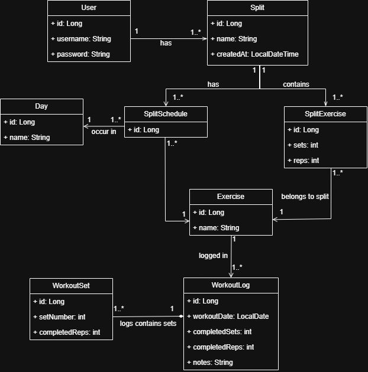

# Workout Tracker Spring Boot App

This app is designed to help users track their progress in the gym. It allows you to create a workout split, register the work completed during each session, and monitor your progress over time. The project originated from a personal need for a digital solution to track workout metrics, as using pen and paper proved cumbersome and impractical.

Although unit tests have not been written yet and some issues remain unresolved, I am setting the project aside for now due to the significant time already invested.

---

## Overview

### Purpose
The app provides a digital solution for planning and logging gym workouts, eliminating the need for manual tracking.

### Core Functionality
- **Create a workout split**: Define different workout splits for different days of the week.
- **Define exercises for the split**: Assign exercises, sets, and reps for each workout split.
- **Log completed workouts**: Record completed sets, reps, and additional notes for each workout session.
- **Track progress**: Review your logged workouts to monitor improvements over time.

---

## Functional Requirements
- **Create a split**: Define a workout split with specific exercises, sets, and reps.
- **Define workouts for the split**: Assign exercises to each split, specifying the number of sets and reps.
- **Log workouts**: Allow users to log completed exercises, sets, and reps.
- **Track progress**: Display logged workouts to visualize progress over time.

---

## Bugs and Issues
- **Login issue**: Users cannot log in if a token from a previous session is still stored in memory.
- **Incorrect login response**: The login method erroneously returns user credentials in the `splits` key of the JSON response.

---

## Setup Instructions

### Prerequisites
Ensure you have the following installed:
- Docker
- Node.js
- Angular CLI

### Setup Steps
1. **Install dependencies for the frontend**:
   Navigate to the `/frontend` directory and run:
   ```bash
   npm install
   ```

2. **Install Angular CLI globally**:
   ```bash
   npm install -g @angular/cli
   ```

3. **Build the Angular app**:
   In the `/frontend` directory, build the Angular app by running:
   ```bash
   ng build
   ```
   This will compile the Angular app into the `/dist` directory.

4. **Create `.env` file**:
   At the root of the project, create a `.env` file with the following content:
   ```env
   DB_URL=jdbc:postgresql://postgres-db:5432/workout_db
   DB_USERNAME=your_db_username
   DB_PASSWORD=your_db_password
   ```

5. **Build Docker containers**:
   From the root directory, build the Docker containers:
   ```bash
   docker compose build
   ```

6. **Start the app in detached mode**:
   ```bash
   docker compose up -d
   ```

7. **Access the app**:
   The app should now be available at:
   ```
   http://localhost
   ```

---

## Codebase Walkthrough

### Directory Structure
- **Frontend**: Contains the Angular app.
- **Backend**: Houses the Spring Boot API.

### Important Files

#### Backend:
- **`application.yml`**: Located under `src/main/resources`, this file contains the datasource and JPA configurations for the API.
- **`Dockerfile`**: Located under `./backend/`, this file configures a Debian-based container and installs the necessary dependencies to run the backend.

#### Frontend:
- **`Dockerfile`**: Initializes the required dependencies for the Angular app.
- **`assets` folder**: Contains Bootstrap, enabling the app to maintain its styling even without an internet connection.

#### Root:
- **`nginx.conf`**: Configures NGINX as a reverse proxy to forward requests to the backend service, using Docker Compose’s DNS service rather than IP addresses for endpoint calls.
- **`docker-compose.yml`**: Defines all the containers required to run the application.

### Diagrams

#### Class diagram


---

## Future Roadmap
1. Refactor the endpoint to avoid overfetching data, using DTOs.
2. Write unit tests for both the frontend and backend.
3. Implement data validation before storing or making requests.
4. Apply user-friendly error handling.
5. Improve the Docker Compose configuration to simplify the setup process to just `docker compose build` and `docker compose up`.

---

## Technologies Used
- **Java 23**
- **Spring Boot**
- **Angular**
- **Bootstrap**
- **PostgreSQL**
- **NGINX**
- **Docker**

--- 

This version is more organized, with clear section breaks and concise explanations. It should be easier to follow and understand.
